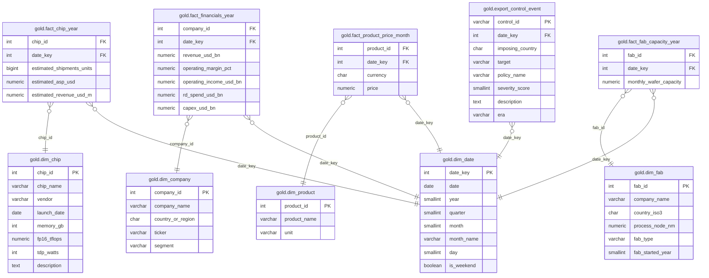

# Semiconductor Star Schema

Dimensional modeling of the [Global Semiconductor Industry 2010–2026](https://www.kaggle.com/datasets/sergionefedov/global-semiconductor-industry-2010-2026)
dataset on a medallion architecture — bronze → silver → gold — in PostgreSQL, ingested with Python.

## Data flow

```
kagglehub (source CSVs)  →  bronze (raw TEXT)  →  silver (typed/conformed)  →  gold (star schema)
```

- **bronze** — one table per CSV, all `TEXT`, loaded verbatim so a bad value can never break the ingest.
- **silver** — types applied, vocabulary normalized, `era` derived from the source flags.
- **gold** — the dimensional model: `dim_*` + `fact_*` star schemas, a conformed `dim_date`, and one event table.

## Data model

| Source CSV | Pattern | Grain (one row =) | Gold tables |
|---|---|---|---|
| `ai_chip_market.csv` | Star | one chip, one year | `dim_chip`, `fact_chip_year` |
| `chip_companies_financials.csv` | Star | one company, one year | `dim_company`, `fact_financials_year` |
| `chip_prices.csv` | Star | one product, one month | `dim_product`, `fact_product_price_month` |
| `fab_capacity.csv` | Star | one fab, one year | `dim_fab`, `fact_fab_capacity_year` |
| `export_controls.csv` | Event | one policy action | `export_control_event` |

Facts join dimensions on surrogate keys; the fact primary key encodes the grain (e.g.
`(company_id, date_key)`). A conformed `dim_date` (integer `date_key`, day grain) is shared by
every fact and the event table. The event table has no additive measure, so it is modeled as a
single table rather than a forced star.

## ER diagram

ER diagram of the gold layer. `make diagram` regenerates the raw output (`diagrams/schema.mmd`)
from the live schema with [tbls](https://github.com/k1LoW/tbls).



## Project layout

```
├── docker-compose.yml      # PostgreSQL 18 (localhost-only, creds from .env)
├── Makefile                # ingest / query / diagram / psql / format / lint / typecheck
├── .env.example            # connection settings template (copy to .env)
├── pyproject.toml          # dependencies + ruff + pyright config
├── uv.lock                 # locked dependency versions
├── .pre-commit-config.yaml # commit-message linting (Conventional Commits)
├── .tbls.yml               # tbls config (documents the gold layer)
├── sql/
│   ├── 01_bronze.sql       # raw CSV mirrors (TEXT)
│   ├── 02_silver.sql       # typed + conformed tables
│   ├── 03_gold.sql         # star schema (dim_*/fact_* + event)
│   ├── 04_transform.sql    # bronze → silver → gold
│   └── 05_queries.sql      # sample analytical queries
├── scripts/
│   └── ingest.py           # download (kagglehub) → COPY → transform
└── diagrams/
    └── schema.mmd          # generated ER diagram
```

## Run

Prerequisites: [Docker](https://docs.docker.com/get-docker/), [uv](https://docs.astral.sh/uv/), and
[tbls](https://github.com/k1LoW/tbls) (for `make diagram`).

```sh
uv sync               # install dependencies into .venv (from pyproject.toml)
cp .env.example .env  # once; edit the password if you like

make ingest     # download the dataset, load bronze → silver → gold, print row counts
make query      # run the sample analytical queries
make diagram    # regenerate diagrams/schema.mmd from the live schema
make psql       # open a psql shell
make down       # stop the container
```

Development: `make check` runs `ruff` lint + format, `sqlfluff` SQL lint, and `basedpyright` type checking.

Commit messages follow [Conventional Commits](https://www.conventionalcommits.org/) and are
validated by a `pre-commit` `commit-msg` hook. Enable it once:

```sh
uv run pre-commit install --hook-type commit-msg
```

`kagglehub` may require Kaggle credentials for the download; export `KAGGLE_USERNAME` and
`KAGGLE_KEY` if prompted.
